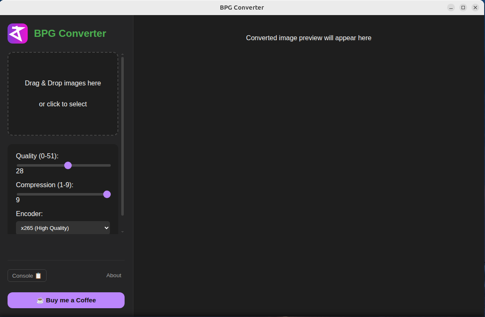

# BPG Converter Website

The official landing page for the **BPG Converter** desktop application. This website serves as the main hub for downloading the app, learning about the BPG format, and accessing developer resources.



## 🚀 Features

-   **Smart Downloads**: Automatically detects the user's operating system (Windows, Linux, macOS) and provides the correct download link.
-   **Live Updates**: Fetches the latest release version and assets directly from the [GitHub Releases API](https://docs.github.com/en/rest/releases/releases).
-   **Developer Guide**: dedicated documentation on how to embed and use BPG images on the web using `bpgdec.js`.
-   **Modern UI**: Built with a clean, responsive design using **Tailwind CSS v4** and **React**.
-   **Dark Mode Ready**: Designed with a sleek aesthetic that complements the dark-themed desktop app.

## 🛠️ Tech Stack

-   **Framework**: [React](https://react.dev/)
-   **Build Tool**: [Vite](https://vitejs.dev/)
-   **Styling**: [Tailwind CSS v4](https://tailwindcss.com/)
-   **Routing**: [React Router](https://reactrouter.com/)
-   **Icons**: [Lucide React](https://lucide.dev/)

## 📦 Installation

To run this project locally:

1.  **Clone the repository:**
    ```bash
    git clone https://github.com/DaveMex/BPGconverter-website.git
    cd BPGconverter-website
    ```

2.  **Install dependencies:**
    ```bash
    npm install
    ```

3.  **Start the development server:**
    ```bash
    npm run dev
    ```

4.  **Build for production:**
    ```bash
    npm run build
    ```

## 🤝 Contributing

Contributions are welcome! Please feel free to submit a Pull Request.

## 📄 Credits

-   **App Developer**: [DaveMex](https://github.com/DaveMex)
-   **Original BPG Format**: [Fabrice Bellard](https://bellard.org/bpg/)
-   **Lib Update Author**: [DaveMex](https://github.com/DaveMex/libbpg_updated)

## ☕ Support

If you find this project useful, you can support the development by buying me a coffee:

[](https://buymeacoffee.com/davemx)
